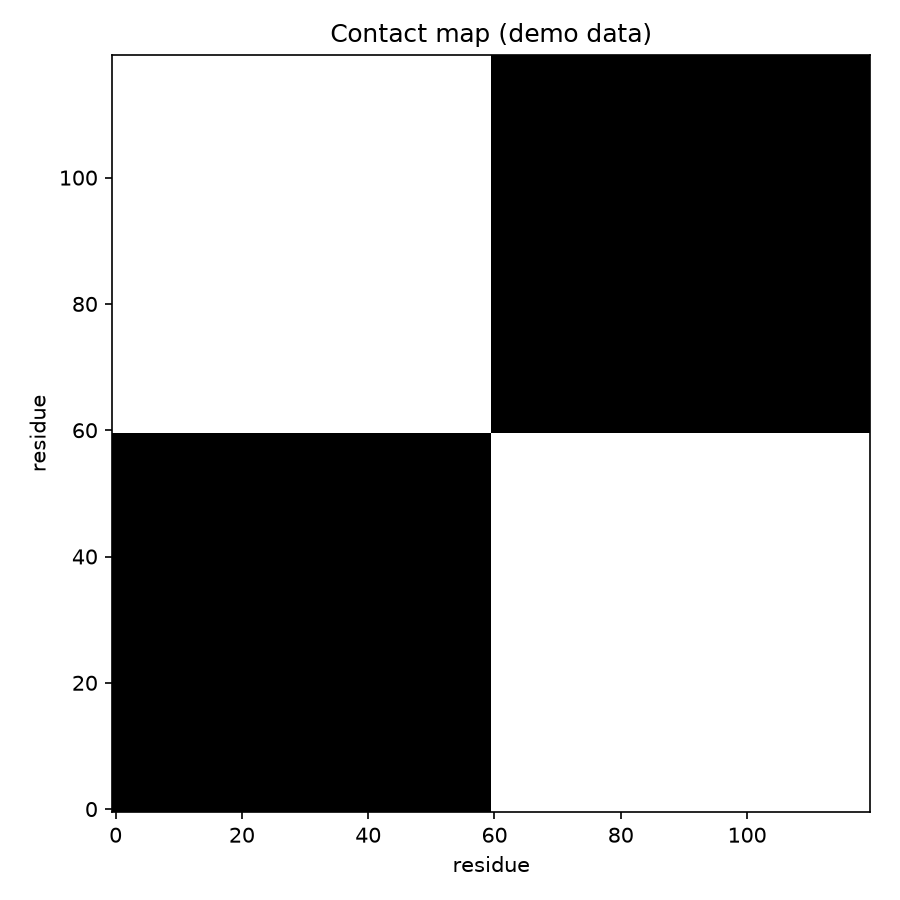

# Protein Contact Map

Flatten a protein's 3D structure into a 2D grid of 'which residues touch' and its architecture jumps out — domains, helices, and the interfaces that do the work.

## Why This Matters

Contact maps are how structural biologists (and every protein-structure predictor, including AlphaFold internally) reason about folds. Residues far apart in sequence but touching in space appear as off-diagonal contacts; compact domains appear as dense blocks. It is the compact, comparable representation of a structure.

## How It Works

1. Compute the distance between every pair of residues' alpha carbons.
2. Threshold at a contact distance (~8 angstrom).
3. Plot the binary contact matrix.

## What the Demo Shows



The demo builds a backbone with two compact domains. The map shows two dense blocks along the diagonal (the domains) with sparse contacts between them — exactly how you would spot a two-domain protein from its structure.

## Run It

```bash
pip install -r requirements.txt
python demo.py
```

> Demonstrated on synthetic data, so it's fully reproducible with no external downloads.
